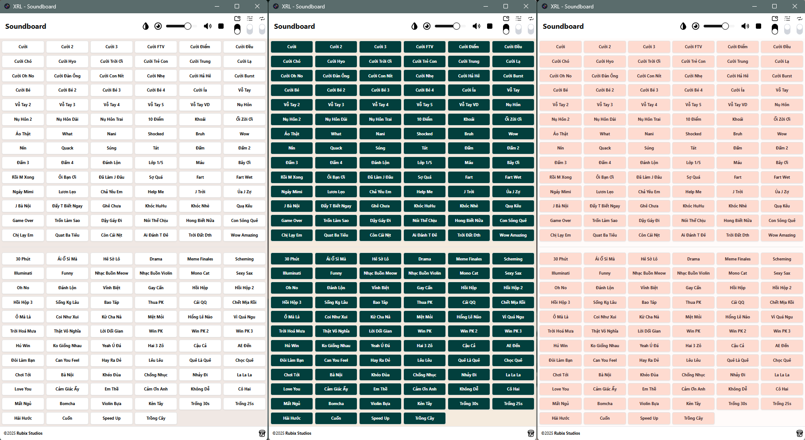

# Soundboard

A feature-rich desktop soundboard application built with Electron and React — perfect for livestreaming on TikTok Live, Bigo Live, Twitch, and Nimo TV.

Một ứng dụng soundboard dành cho máy tính, được xây dựng bằng Electron và React — lý tưởng cho các buổi livestream trên TikTok Live, Bigo Live, Twitch và Nimo TV.



## Features

- Modern, responsive UI built with TailwindCSS
- Hotkey support for quick sound playback
- Audio settings management
- 130+ built-in sound effects
- Customizable sound organization

## Technical Stack

- **Frontend**: React 19 with TypeScript
- **Desktop Runtime**: Electron 35
- **Styling**: TailwindCSS 4.0
- **UI Components**: Radix UI
- **State Management**: React Context
- **Data Persistence**: Electron Store

## Installation

1. Clone the repository
2. Install dependencies:

```bash
npm install
```

## Available Scripts

- `npm start` - Cleans, builds, and starts the application
- `npm run dev` - Starts the app in development mode with hot reload
- `npm run build` - Builds the application
- `npm run build:win` - Creates a portable Windows executable
- `npm run build:mac` - Creates a portable MacOS executable

### Development Scripts

- `npm run watch:app` - Watch for source code changes
- `npm run watch:css` - Watch for CSS changes
- `npm run electron:dev` - Run Electron with live reload

## Project Structure

```txt
soundboard/
├── src/                # Source code
│   ├── app/            # Main app components
│   ├── components/     # Reusable UI components
│   ├── context/        # React contexts
│   ├── hooks/          # Custom React hooks
│   └── utils/          # Utility functions
├── sound/              # Sound effect files
└── dist/               # Build output
```

## Building for Production

To create a portable Windows executable:

```bash
npm run build:win
```

To create a portable MacOS executable:

```bash
npm run build:mac
```

The built application will be available in the `release` directory.

## License

MIT License - See full license in LICENSE file.

## Author

Rubix Studios Pty. Ltd.

## Contact

For support or inquiries, contact Vincent Vu [@rubixvi](https://x.com/rubixvi) on X.

Rubix Studios - [https://www.rubixstudios.com.au](https://www.rubixstudios.com.au).
