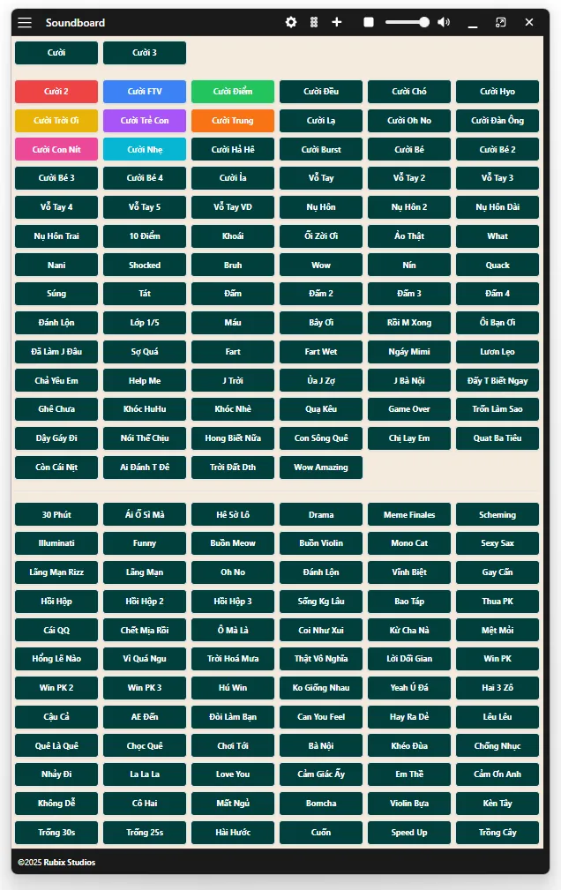

# Soundboard

<!-- Project Info -->

[](LICENSE)
[](https://github.com/rubixvi/soundboard)

<!-- Activity & Quality -->

[](https://github.com/rubixvi/soundboard/commits)
[](https://github.com/rubixvi/soundboard/issues)
[](https://github.com/rubixvi/soundboard/pulls)

<!-- Community -->
[](https://github.com/rubixvi/soundboard/stargazers)
[](https://github.com/rubixvi/soundboard/network)
[](https://github.com/rubixvi/soundboard)

A feature-rich desktop soundboard application built with Electron and React — perfect for livestreaming on TikTok Live, Bigo Live, Twitch, and Nimo TV.

Một ứng dụng soundboard dành cho máy tính, được xây dựng bằng Electron và React — lý tưởng cho các buổi livestream trên TikTok Live, Bigo Live, Twitch và Nimo TV.

## System Requirements

- Windows 10 or later
- macOS 10.13 or later
- 4GB RAM minimum
- 500MB disk space

## Security

Please see our [Security Policy](SECURITY.md) for information about:

- Supported versions
- Reporting vulnerabilities
- Security best practices



## Features | Tính năng

- Modern, responsive UI built with TailwindCSS
- Hotkey support for quick sound playback
- Advanced sound management:
  - Hide/Show sounds with checkbox toggles
  - Custom color coding for sound organization
  - Multi-sound and repeat playback options
- Audio settings management
- 130+ built-in sound effects
- Customizable sound organization
- Persistent settings across sessions

---

- Giao diện hiện đại, đáp ứng được xây dựng với TailwindCSS
- Hỗ trợ phím tắt để phát âm thanh nhanh chóng
- Quản lý âm thanh nâng cao:
  - Ẩn/Hiện âm thanh với các hộp kiểm
  - Mã màu tùy chỉnh để tổ chức âm thanh
  - Tùy chọn phát đa âm thanh và lặp lại
- Quản lý cài đặt âm thanh
- Hơn 130+ hiệu ứng âm thanh tích hợp sẵn
- Tổ chức âm thanh tùy chỉnh
- Lưu cài đặt giữa các phiên

## Sound Organization | Tổ chức âm thanh

### Hide/Show Sounds | Ẩn/Hiện âm thanh

- Click the hide button in the header to enter hide mode
- Use checkboxes to select sounds to hide
- Click hide again to hide selected sounds
- Hidden sounds remain hidden until unhidden

---

- Nhấp vào nút ẩn trên thanh header để vào chế độ ẩn
- Sử dụng hộp kiểm để chọn âm thanh cần ẩn
- Nhấp lại nút ẩn để ẩn các âm thanh đã chọn
- Âm thanh bị ẩn sẽ giữ trạng thái ẩn cho đến khi được hiện lại

### Color Coding | Mã màu

- Click the color button to enter color mode
- Click the color picker on any sound to choose from preset colors
- Colors persist between sessions
- Use the ✕ button to remove a color

---

- Nhấp vào nút màu để vào chế độ màu
- Nhấp vào bộ chọn màu trên bất kỳ âm thanh nào để chọn từ các màu có sẵn
- Màu sắc được lưu giữa các phiên
- Sử dụng nút ✕ để xóa màu

### Themes | Giao diện màu

- Click the theme button in the header to open theme picker
- Choose from 5 preset themes:
  - Green: Nature-inspired with cream background
  - Pink: Light pastel theme
  - Blue: Dark navy theme
  - Light Green: Clean minimal theme
  - Yellow: Dark mode with yellow accents
- Theme selection persists between sessions

---

- Nhấp vào nút giao diện màu trên thanh header để mở bộ chọn giao diện
- Chọn từ 5 giao diện màu có sẵn:
  - Xanh lá: Lấy cảm hứng từ thiên nhiên với nền màu kem
  - Hồng: Giao diện pastel nhẹ nhàng
  - Xanh dương: Giao diện xanh đậm
  - Xanh lá nhạt: Giao diện tối giản
  - Vàng: Giao diện tối với điểm nhấn màu vàng
- Lựa chọn giao diện được lưu giữa các phiên

## Technical Stack

- **Frontend**: React 19 with TypeScript
- **Desktop Runtime**: Electron 35
- **Styling**: TailwindCSS 4.0
- **UI Components**: Radix UI
- **State Management**: React Context
- **Data Persistence**: Electron Store

## Installation

1. Clone the repository
2. Install dependencies:

```bash
npm install
```

## Available Scripts

- `npm start` - Cleans, builds, and starts the application
- `npm run dev` - Starts the app in development mode with hot reload
- `npm run build` - Builds the application
- `npm run build:win` - Creates a portable Windows executable
- `npm run build:mac` - Creates a portable MacOS executable

### Development Scripts

- `npm run watch:app` - Watch for source code changes
- `npm run watch:css` - Watch for CSS changes
- `npm run electron:dev` - Run Electron with live reload

## Project Structure

```txt
soundboard/
├── src/                # Source code
│   ├── app/            # Main app components
│   ├── components/     # Reusable UI components
│   ├── context/        # React contexts
│   ├── data/           # Sound data
│   ├── hooks/          # Custom React hooks
│   ├── lib/            # Utility libraries
│   ├── styles/         # Global styles
│   ├── types/          # Type definitions
│   └── utils/          # Utility functions
├── sound/              # Sound effect files
└── dist/               # Build output
```

## Building for Production

To create a portable Windows executable:

```bash
npm run build:win
```

To create a portable MacOS executable:

```bash
npm run build:mac
```

The built application will be available in the `release` directory.

## Contributing

Contributions are welcome! Please read our:

- [Security Policy](SECURITY.md) for reporting vulnerabilities
- [Code of Conduct](CODE_OF_CONDUCT.md) for community guidelines
- Create issues for bugs or feature requests
- Submit pull requests for any improvements

## License

MIT License - See full license in LICENSE file.

## Author

Rubix Studios Pty. Ltd.

## Contact

For support or inquiries, contact Vincent Vu

- Tiktok: [@rubixvi](https://www.tiktok.com/@rubixvi)
- BigoTV: [@a.vinh](https://www.bigo.tv/a.vinh)
- Facebook: [@rubixvi](https://www.facebook.com/rubixvi/)

Rubix Studios - [https://www.rubixstudios.com.au](https://www.rubixstudios.com.au).
